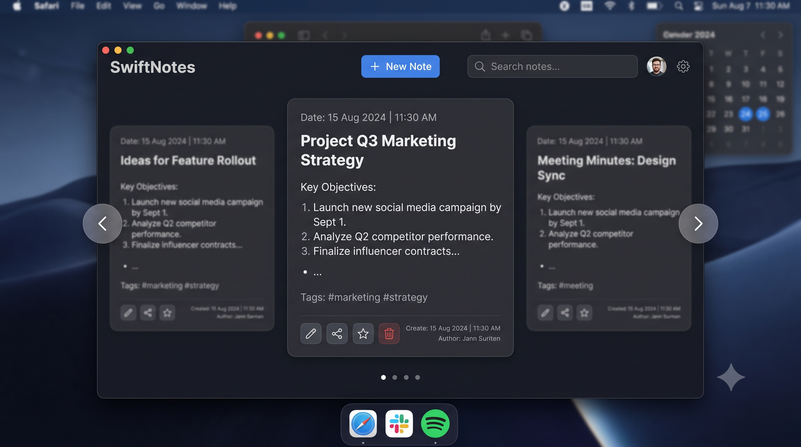

# Swift-Notes 📝

A modern, full-stack web application for taking and managing notes efficiently. Swift-Notes provides a clean and intuitive interface for users to create, organize, and retrieve their notes with ease.

## 📸 Preview



## ✨ Features

- **Create Notes**: Quickly create new notes with a simple and intuitive interface
- **Edit & Delete**: Modify existing notes or remove them when no longer needed
- **Organize**: Keep your notes organized and easily accessible
- **Persistent Storage**: All notes are securely stored in the backend database
- **Responsive Design**: Works seamlessly on desktop and mobile devices
- **Real-time Updates**: See changes instantly as you work with your notes

## 🛠️ Tech Stack

### Frontend
- **HTML**: Structure and markup
- **CSS**: Styling and responsive design (44% of codebase)
- **JavaScript**: Interactive functionality and DOM manipulation (54% of codebase)

### Backend
- Node.js / Express.js (or similar REST API framework)
- Database: MongoDB / SQL (for persistent note storage)

## 📁 Project Structure

```
Swift-Notes/
├── frontend/              # Frontend application
│   ├── index.html        # Main HTML file
│   ├── style.css         # Styling
│   └── script.js         # Frontend logic
├── Backend/              # Backend API and server
│   ├── server.js         # Main server file
│   ├── routes/           # API routes
│   ├── models/           # Database models
│   └── controllers/      # Business logic
├── UI.png               # Application screenshot
├── .gitignore           # Git ignore file
└── README.md            # This file
```

## 🚀 Getting Started

### Prerequisites
- Node.js (v14 or higher)
- npm or yarn package manager
- Git

### Installation

1. **Clone the repository**
   ```bash
   git clone https://github.com/AnantKumarSingh26/Swift-Notes.git
   cd Swift-Notes
   ```

2. **Install backend dependencies**
   ```bash
   cd Backend
   npm install
   ```

3. **Install frontend dependencies** (if applicable)
   ```bash
   cd ../frontend
   npm install
   ```

### Running the Application

1. **Start the backend server**
   ```bash
   cd Backend
   npm start
   # Server runs on http://localhost:5000 (or configured port)
   ```

2. **Open the frontend**
   - Open `frontend/index.html` in your browser, or
   - If using a dev server: `npm start` from the frontend directory

## 💻 Usage

1. Open the application in your browser
2. Click "New Note" to create a note
3. Enter your note title and content
4. Click "Save" to store your note
5. View all notes in the notes list
6. Click "Edit" to modify a note or "Delete" to remove it

## 📝 API Endpoints

### Notes
- `GET /api/notes` - Retrieve all notes
- `POST /api/notes` - Create a new note
- `GET /api/notes/:id` - Get a specific note
- `PUT /api/notes/:id` - Update a note
- `DELETE /api/notes/:id` - Delete a note

## 🔧 Configuration

Create a `.env` file in the Backend directory for environment variables:

```env
PORT=5000
DATABASE_URL=your_database_connection_string
NODE_ENV=development
```

## 🤝 Contributing

Contributions are welcome! Here's how you can help:

1. Fork the repository
2. Create a feature branch (`git checkout -b feature/amazing-feature`)
3. Commit your changes (`git commit -m 'Add some amazing feature'`)
4. Push to the branch (`git push origin feature/amazing-feature`)
5. Open a Pull Request

## 📄 License

This project is open source and available under the MIT License.

## 🙋 Support

If you encounter any issues or have questions, feel free to:
- Open an [issue](https://github.com/AnantKumarSingh26/Swift-Notes/issues)
- Create a discussion in the repository

## 👨‍💻 Author

**Anant Kumar Singh**
- GitHub: [@AnantKumarSingh26](https://github.com/AnantKumarSingh26)

---

**Happy Note-Taking! 📚✨**
